# Deploy SPA

<p align='center'>
  
</p>

## Descripción

<p>Tutorial de como hacer un deployment de una SPA, tanto el backend como el frontend. Para hacer el deployment del back, vamos a utilizar <a href="https://www.heroku.com
">Heroku</a> para nuestra base de datos de ProgreSQL y nuestro servidor de Express, y para el front, vamos a utilizar <a href="https://vercel.com/">Vercel</a>.<br><br/></p>

## Configurando el backend

---

1. Empezaremos editando el <strong>package.json</strong> de nuestro back, en mi caso se encuentra dentro de la ruta <strong>/api</strong>. Cambiaremos las sigs lineas:

```js
"scripts": {
    "start": "node index.js",
    "start:dev": "nodemon -L"
  },
```

> Acá modificamos el script de start, que será el que Heroku ejecute al momento de levantar nuestra aplicación. Para eso, modificamos la línea de start, reemplazando el <strong>nodemom -L</strong> por <strong>node name.js</strong>, donde <strong>name.js</strong> es el nombre del archivo inicial de su proyecto, el archivo donde se pone en línea el servidor de express. La línea sig es totalmente opcional, pueden agregarla o no, sirve para cuando estemos trabajando de manera local, poder seguir ejecutando nuestro server con Nodemon, y así que los cambios se guarden y apliquen en el momento, sin necesidad de cortar el proceso de Node y volver a ejecutar. En este caso, como es un script diferente al start, para poder ejecutar será necesario el sig comando:

```
npm run start:dev
```

2. Necesitamos cambiar el puerto que utilizamos en express, ya que heroku nos entregara un puerto automáticamente. Para eso, editaremos el archivo <strong>index.js</strong> que se encuentra dentro de nuestra carpeta <strong>/api</strong>, y cambiaremos las sig líneas:

```js
server.listen(process.env.PORT || 3001, () => {
    console.log(
      `%s listening at ${process.env.PORT ? process.env.PORT : 3001}`
    );
```

> Acá estamos configurando Express para que funcione, tanto cuando Heroku nos asigne un puerto, o estemos trabajando de manera local. En Heroku, el puerto se encuentra en una variable de entorno llamada <strong>PORT</strong>, si la variable existe, Express utiliza ese puerto, si no, utilizara el puerto que le configuramos nosotros, en este caso el 3001. También, podríamos en nuestro archivo <strong>.env</strong> definir nuestro puerto cuando trabajemos de manera local.

3. Ahora, necesitamos configurar nuestro server para que acepte peticiones de otras rutas que no sean http://locahost:3000. Para esto vamos a necesitar cors, si no lo tienen instalado, dentro de la carpeta <strong>/api</strong>, ejecutar: <strong>npm install --save cors</strong>. Una vez instalado, será necesario requerirlo y utilizarlo en el server, para eso, en nuestra ruta <strong>/api/src</strong> editaremos nuestro archivo <strong>app.js</strong> de la sig manera:

```js
const cors = require("cors");

server.use(cors());
```

> Como les comente antes, necesitamos modificar nuestro header, para que ahora soporte peticiones no solo de localhost:3000, para eso, dentro del mismo archivo de <strong>app.js</strong>, editaremos nuestro res.header de la sig manera:

```js
res.header("Access-Control-Allow-Origin", "*");
```

> Acá modificamos el 2do parámetro, para poder soportar request de todos los orígenes.

4. Ahora necesitamos configurar nuestra DB, para que cuando este en Heroku se conecte a la DB que creemos ahí, o, si estamos en un entorno local, utilice nuestra DB que tengamos en ProgreSQL. Para hacer eso, modificaremos el archivo <strong>db.js</strong> que se encuentra en la ruta <strong>/api/src</strong>. Cambiaremos las sig lineas:

```js
const { DB_USER, DB_PASSWORD, DB_HOST, DB_NAME } = process.env;
```

```js
let sequelize =
  process.env.NODE_ENV === "production"
    ? new Sequelize({
        database: DB_NAME,
        dialect: "postgres",
        host: DB_HOST,
        port: 5432,
        username: DB_USER,
        password: DB_PASSWORD,
        pool: {
          max: 3,
          min: 1,
          idle: 10000,
        },
        dialectOptions: {
          ssl: {
            require: true,
            // Ref.: https://github.com/brianc/node-postgres/issues/2009
            rejectUnauthorized: false,
          },
          keepAlive: true,
        },
        ssl: true,
      })
    : new Sequelize(
        `postgres://${DB_USER}:${DB_PASSWORD}@${DB_HOST}/${DB_NAME}`,
        { logging: false, native: false }
      );
```

> En este caso, estamos modificando la conexión de Sequelize, y las variables de entornos, nos estamos trayendo una nueva variable <strong>DB_NAME</strong>, por lo que será necesaria agregarla a nuestro archivo <strong>.env</strong> cuando trabajemos de manera local.

<br></br>

Con esto ya tendríamos nuestro backend configurado y listo, tanto para trabajar de manera local, como de manera remota. En este punto, recomiendo probar el servidor, ya sea con:

> npm start

o

> npm run start:dev

<p>
Si todo está correcto, hacer los pusheos y commits necesarios a Github.
<br></br>
</p>

## Configurando el frontend

---

1. Para el front, empezaremos instalando dotenv, parados en nuestra ruta, en mi caso <strong>/client</strong>, haremos <strong>npm install --save dotenv</strong>. Una vez instalado, necesitaremos editar nuestro archivo <strong>index.js</strong> de nuestra ruta <strong>/client/src</strong>. Para hacerlo, agregaremos las sigs líneas:

```js
import axios from "axios";
import dotenv from "dotenv";
dotenv.config();

axios.defaults.baseURL = process.env.REACT_APP_API || "http://localhost:3001";
```

> En este caso, estamos configurando una variable de entorno, que utilizaremos luego en Vercel, para indicarle nuestra URL de nuestra API en Heroku. Importante no colocar la barra al final del http://localhost:3001.

> Al hacer este cambio, necesitamos modificar nuestras actions y nuestras utils, donde estemos utilizando axios para hacer peticiones a nuestro servidor. Para hacerlo haremos los sigs:

```js
axios.get("http://localhost:3001/games");
axios.get(`http://localhost:3001/games?name=${name}`);
```

> Si nuestra action o utilis realizaba una petición de la sig manera, ahora deberemos hacerla así:

```js
axios.get("/games");
axios.get(`/games?name=${name}`);
```

<p> Esto es porque ya hemos seteado la URL base en el <strong>index.js</strong>, y ya no necesitamos agregarla.</p>

<p> En este punto, ya tenemos nuestro front configurado, recomiendo probarlo ejecutando <strong>npm start</strong> y verificando que todas nuestras peticiones estén funcionando correctamente con nuestro servidor. Una vez hecho, realizar los pusheos y commits a Github.<br></br></p>

## Montando nuestro servidor en Heroku

---

- Primero necesitaremos una cuenta, si no tenemos una, crearla <a href="https://signup.heroku.com/">aquí</a>
- Una vez logeado con nuestra cuenta, iremos a nuestro dashboard y le daremos a <strong>Create new app</strong>

<p align="center">
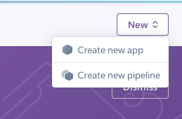
</p>

- En App name ingresaremos el nombre que queramos darle a nuestra api y le damos al botón Create app, ejemplo:

<p align="center">
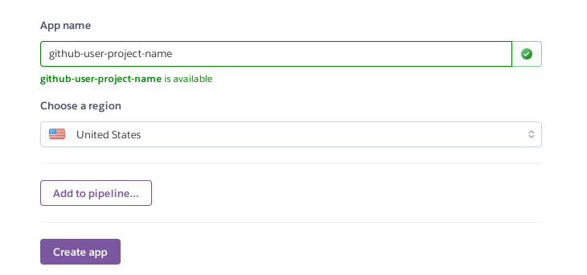
</p>

- Ahora en Deployment method conectamos nuestro github y elegimos nuestro repositorio, no importa que contenga las carpetas de <strong>/api</strong> y <strong>/client</strong>, luego configuraremos eso. Le damos al boton connect, ejemplo:

<p align="center">
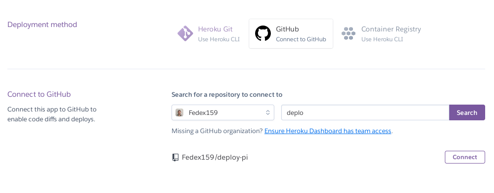
</p>

<p align="center">
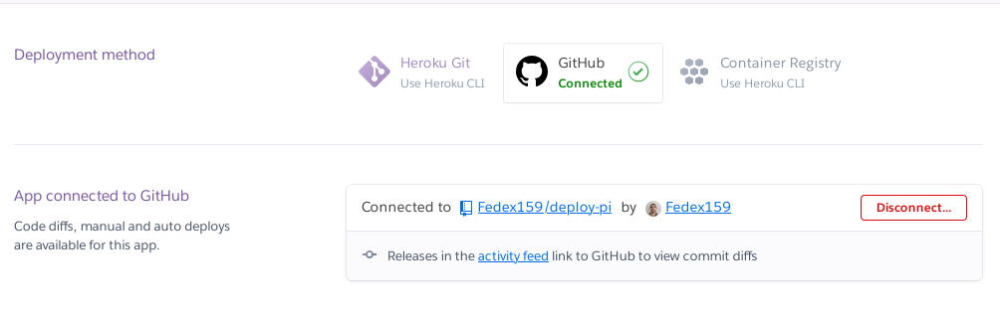
</p>

- Ahora, en la pestaña resources, buscar en Add-ons <strong>Heroku Postgres</strong> y seleccionarla. Se abrira una ventana, seleccionar la opcion <strong>Hobby Dev - Free</strong> y darle al boton submit.

<p align="center">

</p>

<p align="center">
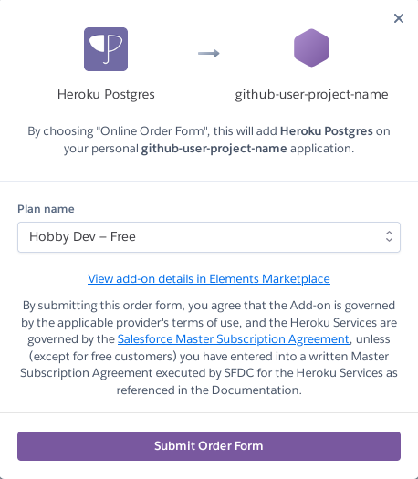
</p>

- Luego hacemos click en <strong>Heroku Postgres</strong>. En la ventana que se abrió, iremos a Settings y luego a <strong>View Credentials...</strong>

<p align="center">
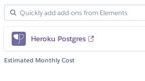
</p>

- Esta pestaña la dejaremos abierta, ya que acá tenemos la información que cargaremos ahora más adelante, para poder indicarle a nuestro servidor los datos de conexión con nuestra db.

- Ahora, en nuestro dashboard de Heroku, iremos a la pestaña <strong>Settings</strong> y a la sección de <strong>Config Vars</strong>, y haremos click en <strong>Reveal Config Vars</strong>.

<p align="center">
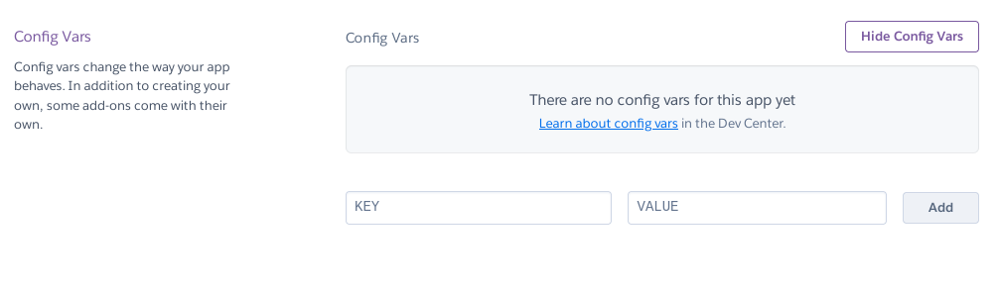
</p>

- Una vez aca, iremos agregando una por una las sigs vars:

| Key          | Value                                                   |
| ------------ | ------------------------------------------------------- |
| DATABASE_URL | (valor que obtenemos de Heroku Postgres en URI)         |
| DB_USER      | (valor que obtenemos de Heroku Postgres en User)        |
| DB_PASSWORD  | (valor que obtenemos de Heroku Postgres en Password)    |
| DB_HOST      | (valor que obtenemos de Heroku Postgres en Host)        |
| DB_NAME      | (valor que obtenemos de Heroku Postgres en Database)    |
| PROJECT_PATH | /api                                                    |
| API_KEY      | Nuestra api_key de nuestro proyecto (api de rawg.io ej) |

- Una vez configurada todas las variables, dentro de <strong>Settings</strong> en el dashboard de Heroku, iremos a la sección <strong>Buildpacks</strong>

<p align="center">
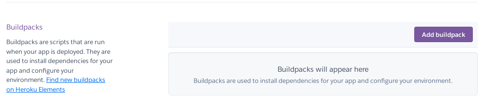
</p>

- Aca agregaremos 2 buildpacks, el primero es el sig:

> https://github.com/timanovsky/subdir-heroku-buildpack

- Lo colocaremos en el campo <strong>Enter Buildpack URL</strong> y le daremos a save changes. Luego volveremos a darle al botón de Añadir buildpack, y esta vez elegiremos nodejs y <strong>save changes</strong>. Necesario que se mantenga este orden, debería quedar de la sig forma:

<p align="center">
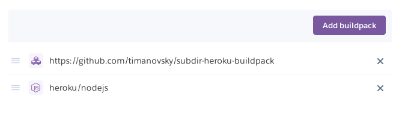
</p>

- Una vez hecho todo, en nuestro dashbord de Heroku, vamos a la pestaña <strong>Deploy</strong>, y marcamos el <strong>Enable Automatic Deploys</strong>

<p align="center">
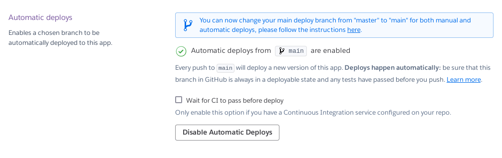
</p>

- Para finalizar, le damos al botón <strong>Deploy Branch</strong> y ya nuestra aplicación estaría en línea. Con el automatic deploy, habilitamos para que cada vez que nosotros hagamos un cambio, nuestro servidor se compile y se vuelve a realizar el deploy, sin necesidad de nosotros estar haciéndolo manualmente. El proceso puede demorar unos minutos.

- En la pestaña Overview podemos ver las actividades que se están realizando, como el build, deploy, etc. Para acceder a nuestro link, solo bastará darle al botón de <strong>Open app</strong>, ese será nuestro enlace a nuestra api.

<p align="center">
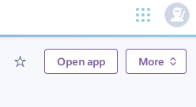
</p>

- Ya pueden realizar todas las pruebas de sus rutas, ejemplo:

```
https://my-app-name.herokuapp.com/ruta
```

<p>Debería devolver los json, hacer los post, etcs que ustedes configuraron.
<br></br></p>

## Montando nuestro front en Vercel

---

- Ingresamos a <a href="https://vercel.com">Vercel</a> y nos logeas con Github.
- Luego hacemos click en New Project

<p align="center">
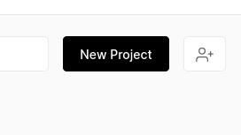
</p>

- Luego, en <strong>Import Git Repository</strong>, le damos a la opción <strong>Add Github Org Or Account</strong>. Le damos los permisos y ya nos debería salir nuestro Github con todos los repositorios disponibles.

<p align="center">
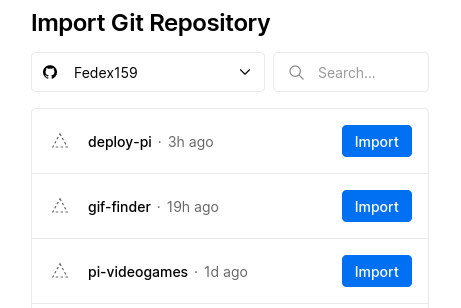
</p>

- Le damos al botón de <strong>Import</strong> sobre el repositorio que tengamos nuestro front.

- En Create a Team le damos a skip.

<p align="center">
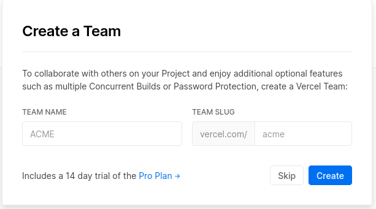
</p>

- En <strong>Configure Project</strong> Seteamos nuestro <strong>Project name</strong>, en Framework Preset elegimos <strong>Create React App</strong>, en Root Directory elegimos nuestra carpeta <strong>/client</strong> de nuestro repo.

<p align="center">
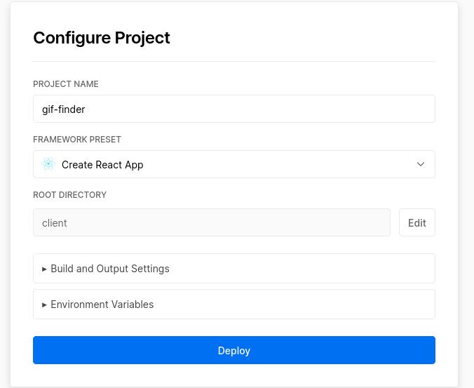
</p>

- Y por ultimo, antes de darle a <strong>Deploy</strong>, nos falta configurar nuestra variable de entorno que habiamos definido antes, para poder utilizar ahora nuestra API de Herouku. Para eso, dentro de <strong>Configure Project</strong> le daremos a la seccion de <strong>Enviorement Variables</strong> y agregaremos nuestra variable asi:

| Name          | Value                                                       |
| ------------- | ----------------------------------------------------------- |
| REACT_APP_API | url de nuestra api de heroku, sin la / final, importante!!! |

<p align="center">
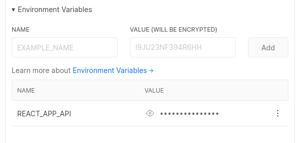
</p>

- Acordarse de darle al botón de <strong>Add</strong> y de que la URL no contenga la última /, que sea del tipo https://my-app-name.herokuapp.com

- Luego, le damos al boton <strong>Deploy</strong>.

Con esto ya tendríamos nuestro Front y Backend deployados. Igual que Heroku, en Vercel, cada vez que se haga un cambio en el repositorio, el Front se volverá a deployar automáticamente, sin necesidad de que nosotros estemos subiendo los cambios manualmente.

<p align="center">
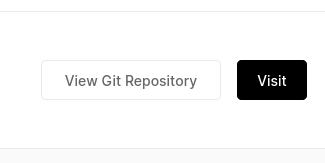
</p>

Una vez que haya terminado el Deploy, nos saldrá un botón para poder visitar nuestro proyecto. En el repositorio de Github, en la sección de About, se habrá agregado un enlace directo a nuestra app.
